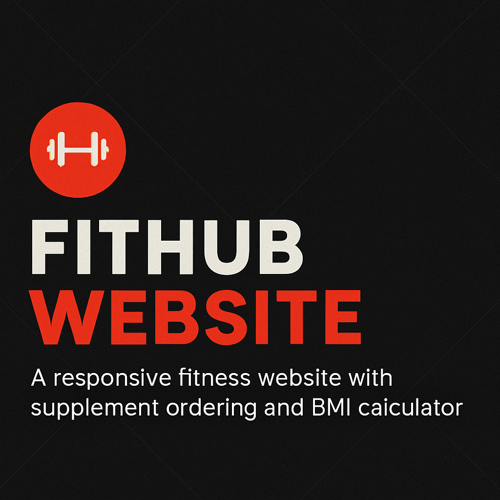

# 💪 FitHub Website

FitHub is a responsive fitness website designed to motivate users toward healthier lifestyles. It features personalized workout programs, supplement ordering, BMI tracking, and admin management—all built with PHP, JavaScript, and CSS.

## 🌐 Live Demo
[🔗 View FitHub Website](https://shazzz04.github.io/fithub-website)

## 🧰 Tech Stack
- **Front-end**: HTML5, CSS3, JavaScript
- **Back-end**: PHP
- **Design**: Figma (UI/UX wireframes)
- **Database**: MySQL (`db.php` integration)

## 🚀 Key Features
- 🏋️‍♀️ **Program Categories**: Strength, Fat Loss, Weight Gain
- 🧮 **BMI Calculator**: Python-powered health tool
- 🛒 **Supplement Store**: Browse and order products
- 👤 **User Authentication**: Registration and login system
- 🧑‍💼 **Admin Dashboard**: Manage classes and products
- 💬 **Testimonials & Class Info**: Build trust and engagement

## 📁 File Highlights
| File                | Purpose                              |
|---------------------|--------------------------------------|
| `main.php`          | Homepage logic                       |
| `supplements.php`   | Product listing                      |
| `checkout.php`      | Order processing                     |
| `register.php`      | User registration                    |
| `admin_dashboard.php`| Admin controls                      |
| `bmi_calculator.py` | BMI calculator logic                 |
| `db.php`            | Database connection setup            |

## 🛠 How to Run Locally
1. Clone the repo:  
   `git clone https://github.com/Shazzz04/fithub-website.git`
2. Set up a local server (XAMPP/WAMP recommended)
3. Import the database using `db.php`
4. Launch `main.php` in your browser

## 👩‍💻 About the Developer
Created by **Shaza**, a final-year Software Engineering student with a passion for front-end development, UI/UX design, and practical web solutions. Currently working as a Process Associate at HCLTech while actively pursuing tech-focused career opportunities.

## 📬 Contact
- 📧 Email: `shazzz04@example.com`
- 🌐 [LinkedIn](https://www.linkedin.com/in/your-profile)
- 🧠 Portfolio: *(Add your portfolio link here if available)*

## 📄 License
This project is licensed under the [MIT License](LICENSE).
