# 💪 FitHub Website

FitHub is a responsive fitness website designed to motivate users toward healthier lifestyles. It features personalized workout programs, supplement ordering, BMI tracking, and admin management—all built with PHP, JavaScript, and CSS.

## 🧰 Tech Stack
- **Front-end**: HTML5, CSS3, JavaScript
- **Back-end**: PHP
- **Design**: Figma (UI/UX wireframes)
- **Database**: MySQL (`db.php` integration)

## 🚀 Key Features
- 🏋️‍♀️ **Program Categories**: Strength, Fat Loss, Weight Gain
- 🧮 **BMI Calculator**:  Health tool
- 🛒 **Supplement Store**: Browse and order products
- 👤 **User Authentication**: Registration and login system
- 🧑‍💼 **Admin Dashboard**: Manage classes and products
- 💬 **Testimonials & Class Info**: Build trust and engagement

## 📁 File Highlights
| File                | Purpose                              |
|---------------------|--------------------------------------|
| `main.php`          | Homepage logic                       |
| `supplements.php`   | Product listing                      |
| `checkout.php`      | Order processing                     |
| `register.php`      | User registration                    |
| `admin_dashboard.php`| Admin controls                      |
| `db.php`            | Database connection setup            |

## 🛠 How to Run Locally
1. Clone the repository:
   git clone https://github.com/Shazzz04/fithub-website.git
2. Start your local server (XAMPP/WAMP/MAMP):
   - Enable Apache
   - Enable MySQL
3. Import the database:
   - Open http://localhost/phpmyadmin
   - Create a new database (example: fitnessbub)
   - Go to the Import tab
   - Upload the database.sql file included in the project
   - Click Go
4. Move the project into your server directory:
   xampp/htdocs/
5. Run the project in your browser:
   http://localhost/ASSIG/main.php
   or
   http://localhost/ASSIG

## 📸 Screenshots

### 🏠 Home Page
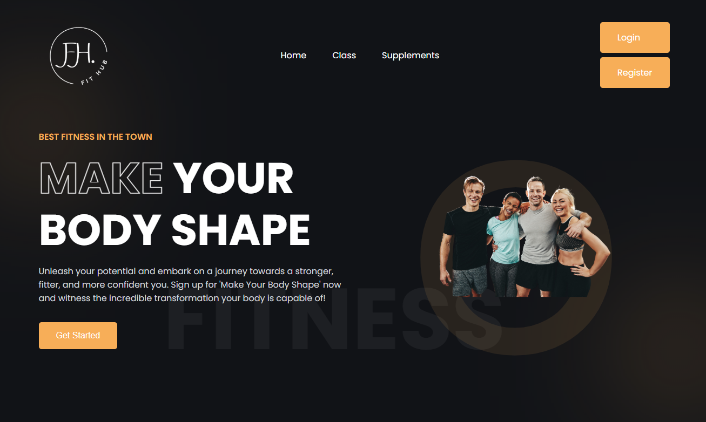
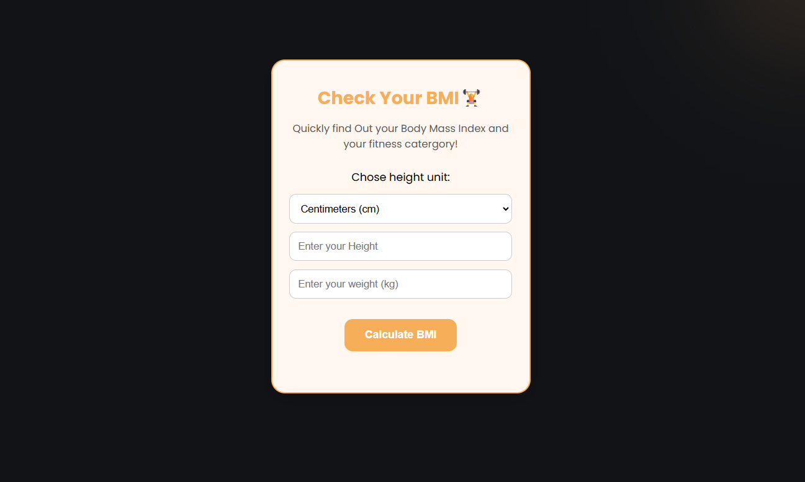

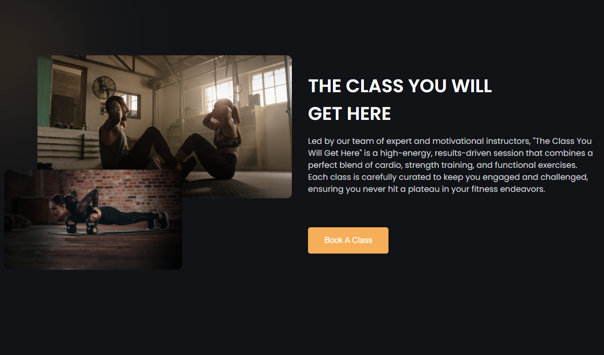

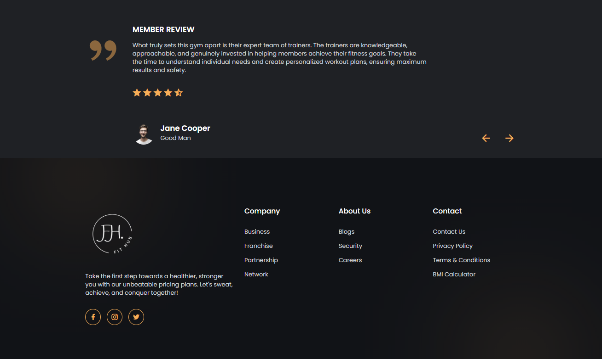

### 🔐 Login Page
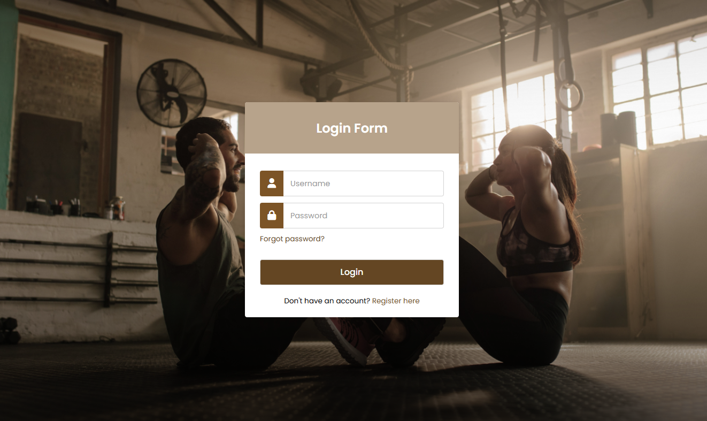

### 📝 Register Page
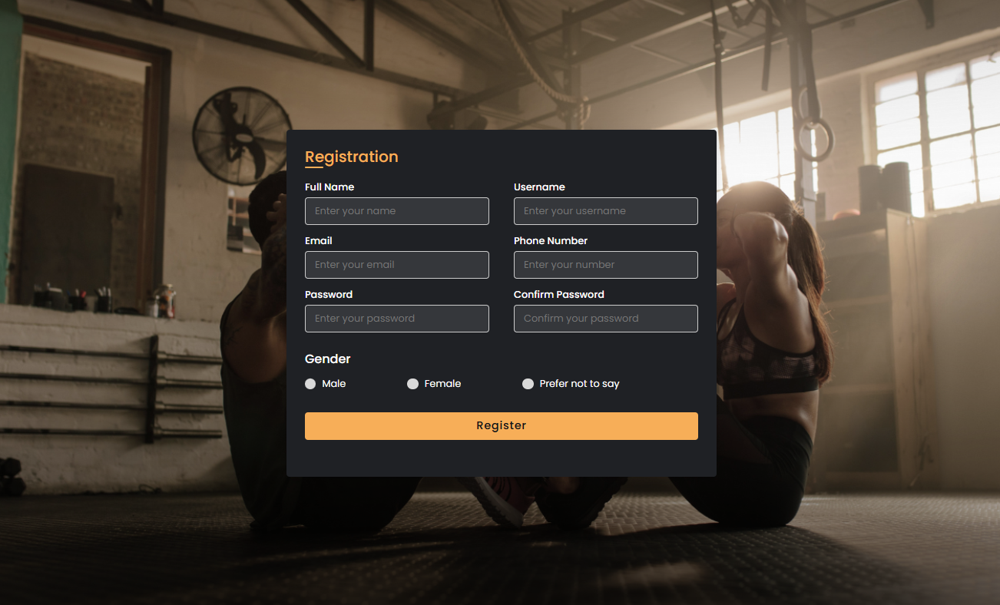

### 💊 Supplement Page
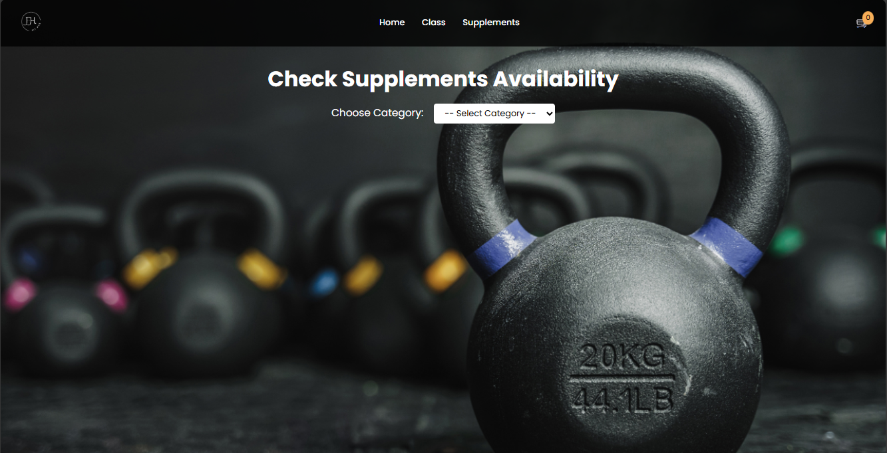
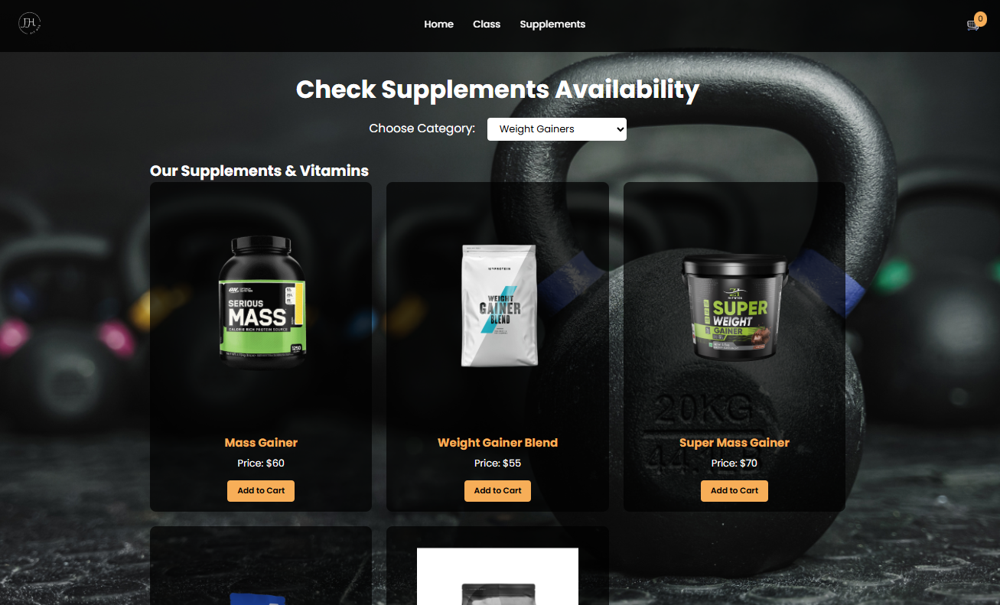

### 🏋️ Class Page
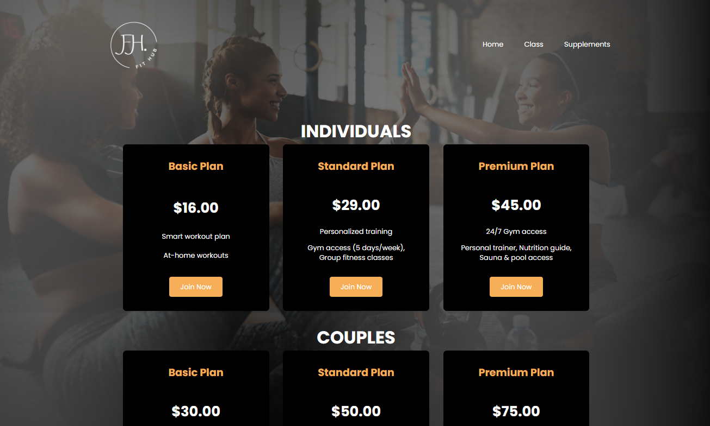

### 🛒 Checkout Page
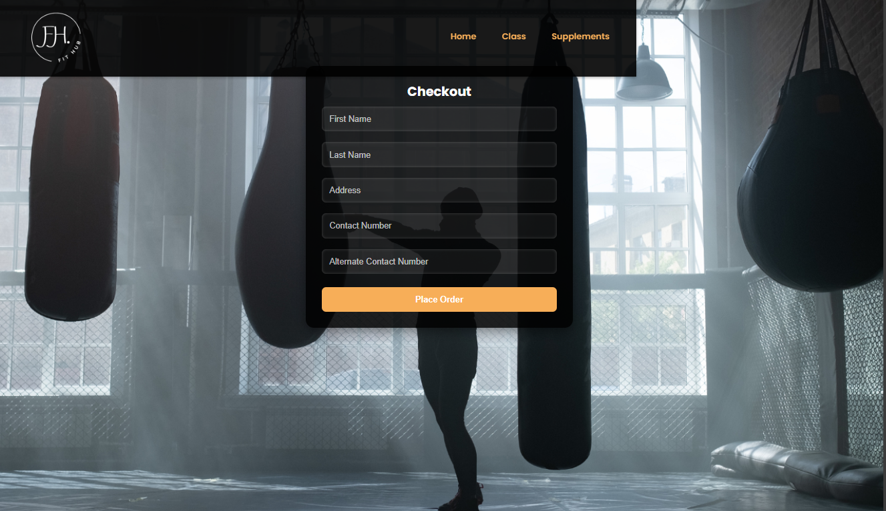

### 🧾 Admin Dashboard
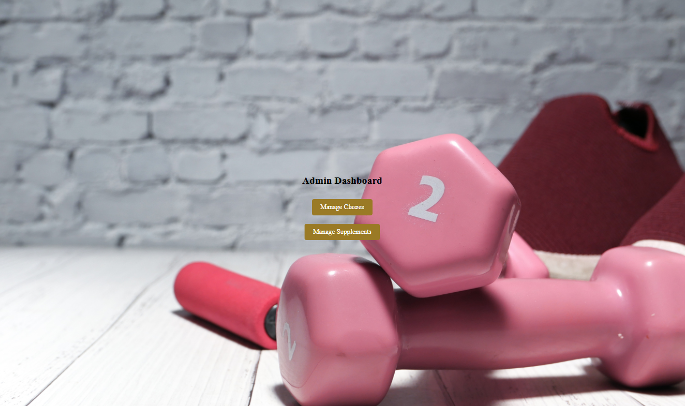
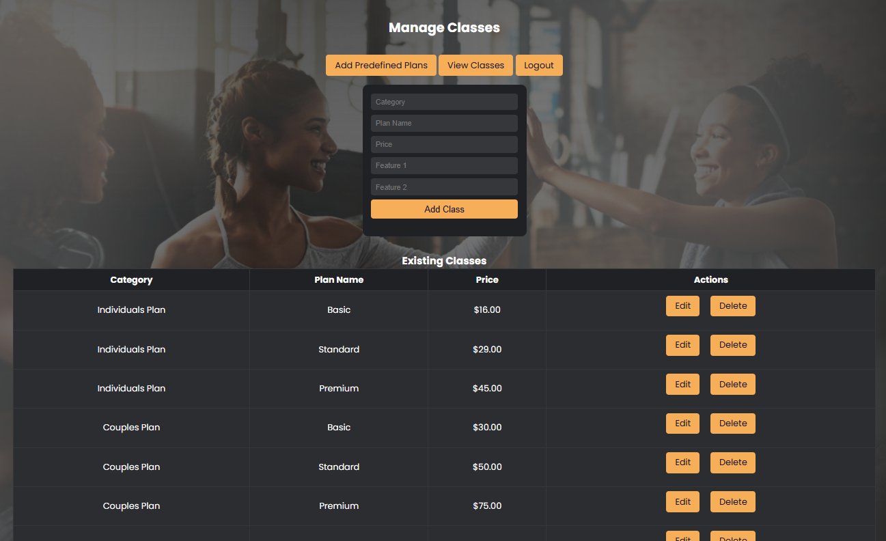
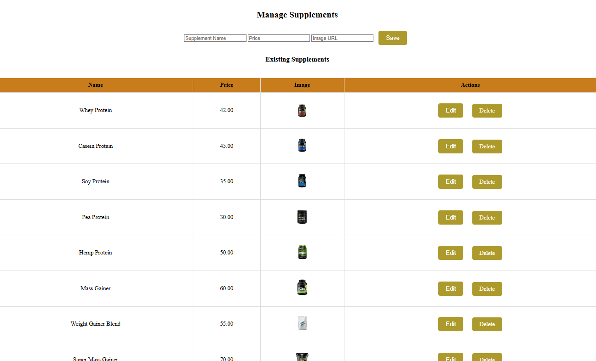

## 👩‍💻 About the Developer
Created by **Shaza Faizer**, a final-year Software Engineering student with a passion for front-end development, UI/UX design, and practical web solutions. Currently working as a Process Associate at HCLTech while actively pursuing tech-focused career opportunities.

## 📬 Contact
- 📧 Email: `shazafaizer20@gmail.com`
- 🌐 [LinkedIn](linkedin.com/in/shaza-faizer-bb5abb2b4)

